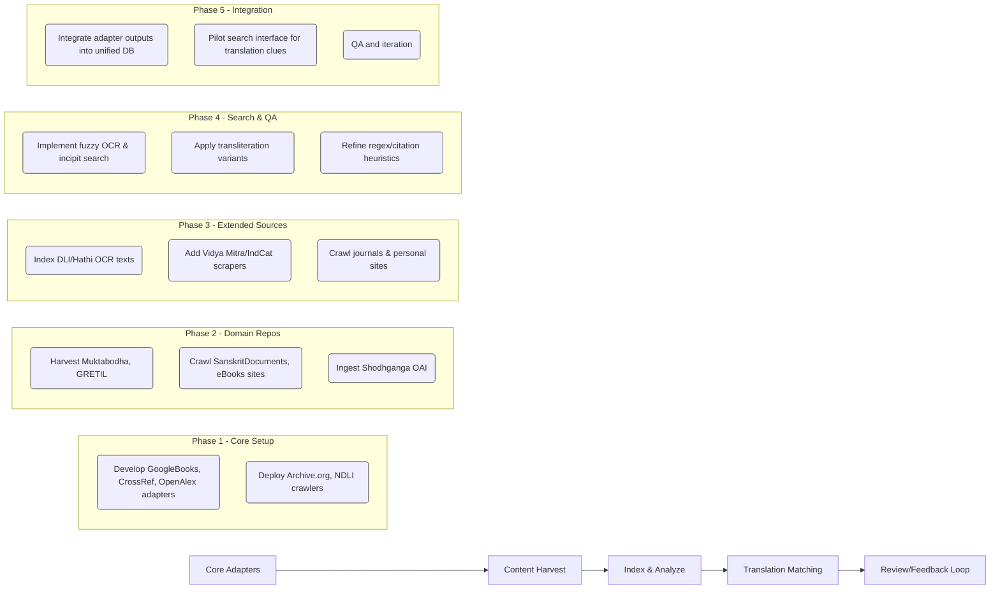
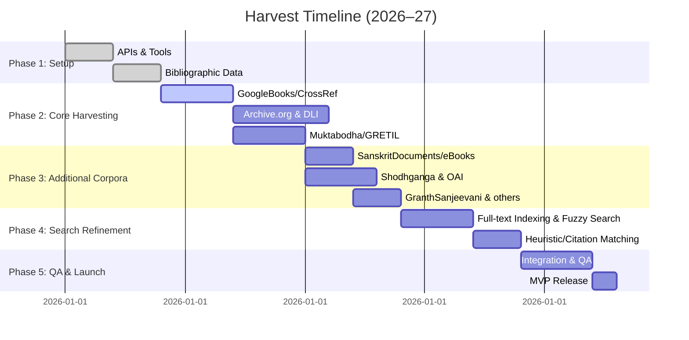

# Repositories of Sanskrit Texts

**Muktabodha Digital Library (Muktabodha)** – A non‐profit Sanskrit archive with *~3,000* digitized texts (over 570 searchable e-texts). Collections include: (i) Kashmir Śaiva, Tantric, Vaiṣṇava works (plain-text TEI and Unicode e-texts, ~380+ texts); (ii) *IFP transcripts* (2,000+ volumes from French Inst. Pondicherry, scanned PDFs + OCR’ed text for incipits/explicits); (iii) *Vedic manuscripts of Gokarna* (image facsimiles). Content types: scanned manuscripts (PDF/PNG), TEI/XML and plain-text e-texts. Access: Web interface (no public API) at muktabodha-digital-library.org; data license: CC BY-NC 4.0 for e-texts (non-commercial reuse, credit Muktabodha), other content “All Rights Reserved”. Maintainer: Muktabodha Indological Research Institute (contact info@muktabodha.org). Metadata: standard bibliographic fields (title, author, tradition, KSTS vol, pagination, editorial notes); full-text search is provided. **Translation evidence:** Muktabodha focuses on original Sanskrit texts; its *Translation Series* (forthcoming books) offers translations of select works, but the Digital Library itself holds only source texts (any translation appears only in project publications, not in the repository).

**GRETIL (Göttingen Register of Electronic Texts in Indian Languages)** – A *comprehensive* online repository of machine-readable Sanskrit (and other Indic) e-texts. It aggregates plain-text or TEI versions of classical texts (Vedas, Puraṇas, Āgama, philosophical works, etc.) from many editors, both published and unpublished. Content: Unicode e-texts (XML, HTML, plain), excluding scanned PDFs. Scope: ~90 GB of texts (over many thousands of works; dozens of language collections). Access: originally via GRETIL website and cumulative ZIPs, now also in a permanent archive (TextGrid/Zenodo). No formal API; one can mirror from GitHub (INDOLOGY/GRETIL-mirror) or use OAI if enabled. License: mixed (some Public Domain, some CC); details depend on each file’s header. Maintainer: SUB Göttingen; contact via J. Calvo Tello (calvotello@sub.uni-goettingen.de). Metadata: minimal on site, but TEI files contain titles/author. Full-text search requires local indexing. **Translation evidence:** GRETIL holds Sanskrit originals; translations would appear only if embedded in commentary editions (rare). 

**Sanskrit Documents Collection** – Volunteer-run library of Hindu scripture and literary texts (mostly stotras, subhāṣitas, Purāṇic excerpts, and tools). Scope: hundreds of HTML/UTF-8 text pages and scanned PDFs. Access: web portal sanskritdocuments.org; no API. License: “not to be copied or reposted” without permission (restrictive). Metadata: categorized by deity/genre, mostly no formal fields beyond title and (occasionally) author/commentator. Search: a site search is provided. **Translation evidence:** The site itself is Sanskrit (or transliterated) texts; however, it links to external translations (e.g. *Sriramodantam Sanskrit Text with English Translation*). Hidden clues could be in blog posts or README files listing translations of classics.

**Sanskrit eBooks (sanskritebooks.org)** – A WordPress “free ebooks” portal that aggregates public-domain Sanskrit book downloads (Kavya Mala series, Trivandrum Granthavali, etc.). Scope: list of ~200 tagged posts linking to external scans or DLI items. Access: web only; no API. License: “All Rights Reserved” on site footer (just a blog), but links are to public-domain texts. Metadata: blog categories, tags (genre, series). **Translation evidence:** Some posts bundle English translations (e.g. *Sriramodantam* with translation). The site often notes “Sanskrit & English” in summaries, which can indicate translation availability.

**Shiva Shakti Mandalam** – A private site (shivashakti.com) offering *Tantric* Hindu texts (PDF and PostScript) and some English commentary. Scope: dozens of titles (Śakti texts, stotras, Upaniṣads, Tantra volumes). Content: scanned/hosted PDFs and PS files. Access: HTML index (no API). License: All rights reserved; “for personal use only”, contact mike.magee@btinternet.com. **Translation evidence:** Some English content is present (e.g. Avalon’s intro to Śaradātilaka, Magic of Kali containing Todala Tantra translation, and *“Avalon’s English introduction”*). Search the site’s text for English words may reveal mentions of translations.

**Granth Sanjīvanī (Asiatic Society, Mumbai)** – A digital repository of the Asiatic Society, with *20,000+* items (books, journals, maps, etc.), including ~2,000 Oriental manuscripts. Many texts (especially older Indology works) in Sanskrit and other languages. Content: scanned books/articles (images+OCR), metadata; supported by a DSpace/JSPUI platform. Access: Web (JSPUI) portal; OAI-PMH *may* be supported (standard DSpace). No public bulk dumps known. Fields exposed: Dublin Core fields (title, author, year, subject, language, publisher, identifier) are visible. “Read” links provide scanned page images. Licensing: generally open access (sponsor-funded) but check each title. **Translation evidence:** Being a broad repository, it includes Indology books and journals – translations may hide in “Other similar items” appendices or within multi-language volumes. Also search journal titles (e.g. “Bhandarkar Oriental” likely archived here).

**Shodhganga@INFLIBNET (Sanskrit Department)** – India’s central PhD thesis repository. Under “Department of Sanskrit” it lists dozens of theses. Content: doctoral dissertations (mostly PDF), in Sanskrit, Hindi, English. Access: Web UI and OAI-PMH (DSpace-based). Key fields: title, author, university, guides, year, subject, language. Full-text search exists via web; OAI can harvest metadata (and often abstracts). **Translation evidence:** PhD theses often contain Sanskrit passages with English commentary or translation, or chapters surveying previous translations. Hidden evidence appears in footnotes, appendices, or translations of quotations within the thesis. E.g., a thesis on a Sanskrit work may translate sample verses. Searching Shodhganga (or extracting full text) for key Sanskrit titles is fruitful.

**Digital Library of India (via Internet Archive)** – DLI’s entire digitized collection has been mirrored on archive.org under “in.ernet.dli.*” identifiers. Scope: ~50,000+ Sanskrit/Indology books (PDF+OCR). Access: Archive.org API; each item has metadata (title, author, language, year) and OCR text. License: Public domain (mostly 19th–early 20th c.). **Translation evidence:** Many scanned books include introductions, footnotes, or appendices (often in English or Hindi) that contain translations of Sanskrit quotations. OCR search across DLI can locate these (e.g. searching for “translation” alongside a text’s title). 

**Sanskrit Library (sanskritlibrary.org)** – A digital library/platform (non-profit) providing access to primary Sanskrit texts and analysis tools. Content: selected digitized texts (e.g. journals, dictionaries, grammar) and interfaces (no bulk download). Access: Web only; no public API; donate-funded. License: open (non-profit). Metadata: search by author, text name. **Translation evidence:** Minimal; focuses on original texts and lexica.

**Other Indology Repositories:** Several specialized collections exist (outside our main list) and deserve mention. For example, **Gaudiya Grantha Mandira** (grantha.jiva.org) – a repository of Gaudiya Vaisnava Sanskrit & Bengali texts. **Hamburg CTS** – Śaiva/Buddhist Tantra plain text files. **GitaSuperSite (IIT Kanpur)** – Sanskrit Gītā, Rāmāyana, Yoga Sūtra etc. in multiple scripts. **SanskritWeb (Ulrich Stiehl)** – large volumes including Vedas, Purāṇas, search fonts. Each offers original texts (and some translations or transliterations) for research.  

## Metadata & Search

In all major repositories, **metadata fields** generally include title, author, language, year, subject, publisher, and internal identifiers (e.g. GRETIL code, handle/ISBN). For example, Granth Sanjīvanī shows DC fields like *Author, Year, Language* and an internal *GP_id*. Muktabodha’s legacy site includes *Sanskrit title, KSTS vol, editor* etc. DSpace systems (Shodhganga, GranthSanjīvanī) expose Dublin Core metadata. Some specialized sites (SanskritDocuments) have minimal metadata beyond headings. Full-text search/OCR availability varies: Shodhganga and Archive.org items have full text; Muktabodha e-texts and DLI scans are searchable via the portal; SanskritDocuments has site search; GRETIL and SanskritLibrary allow full-text queries. 

## Hidden Translation Evidence

Beyond explicit translations, “hidden” evidence may lurk in non-core content. Likely places in each source include:

- **Theses & Dissertations:** (Shodhganga, university IRs) – PhD theses often translate Sanskrit verses or cite earlier translations. Check bibliography, appendices, or case-study chapters for verse translations.
- **Scanned Books/PDFs:** (DLI, GranthSanjīvanī, eJournals) – Introductions, footnotes or appendices in colonial/modern publications may translate stanzas. OCR search on words like *“translation”*, *“meanings”*, or bilingual headings can reveal embedded translations.
- **Commentary/Edition Volumes:** (Muktabodha/CSU collections) – Edits of classical texts often include commentary excerpts or parallel translations. Catalog data (incipits/colophons) may hint at modern language prefaces.
- **Personal Sites/Forums:** (SanskritDocuments, Indology lists) – Scholars’ pages or mailing lists sometimes include translation snippets. E.g., in Indology forums or project README files for Git repos (see below).
- **Journals & E-Journals:** Indian scholarly journals (e.g. *Saṃskṛta Racanā*, *JIP*) – often contain articles with translated passages; many are now online (NDLI, DOAJ). These repositories may hold complete issues.
- **Bibliographic Databases:** Crossref/OpenAlex metadata (for Sanskrit titles) can include “abstracts in English” or related translations, offering leads.

## Programmatic Adapters

A **robust harvesting pipeline** will use multiple adapters (connectors) targeting the sources above. Key adapters include:

- **MuktabodhaAdapter**: Scrapes the Muktabodha Library web interface (or uses the GitHub data updates). No public API; crawl the HTML index or the legacy site (muktalib7.com). Auth: none; Rate: respect site (unknown throttle). Harvest mode: batch scrape of each category page and download TEI/PDF URLs. Sample: GET each text’s page to parse title/author/links.

- **GRETILAdapter**: Pull from the GitHub mirror (INDOLOGY/GRETIL-mirror) or new TextGrid repository. Endpoint: GitHub/Zendo. Auth: none (public Zenodo). Rate: per GitHub API limits or Zenodo. Harvest: use wget on GRETIL site or clone GitHub. Sample: recursive wget for “gretil.sub.uni-goettingen.de” TEI/HTML files as indicated in the mirror’s bash script.

- **SanskritDocumentsAdapter**: Crawl sanskritdocuments.org. No API; would require scraping. Use the site’s sitemap or search page to enumerate texts. Auth: none. Rate: polite crawling. Regex: e.g. extract all links in “Texts” sections. 

- **EbooksAggregatorAdapter**: For sanskritebooks.org and sanskritebooks.org, parse the WordPress posts to get linked titles/PDFs. Rate: low. Tags like “Free Ebooks” index many texts.

- **ShivaShaktiAdapter**: Scrape shivashakti.com/texts index and download linked PDFs/PS. Auth: none. Sample: the `<a>` links 5–21 in [16].

- **GranthSanjeevaniAdapter**: If OAI exists, use OAI-PMH (e.g. `/oai/request?verb=ListRecords&metadataPrefix=oai_dc`). Otherwise scrape JSPUI: use the “simple-search” form or browse by collections (like *Manuscripts*). Auth: none. Rate: respect SUB’s server. Sample: OAI ListIdentifiers with `set=Collection:Manuscript`.

- **ShodhgangaAdapter**: Use Shodhganga’s OAI (as noted): e.g. base `https://shodhganga.inflibnet.ac.in/oai/`. No auth. Rate: moderate. Harvest via bulk OAI or the departmental collections (handles like *handle/10603*). Sample: `ListRecords?metadataPrefix=oai_dc&set=DepartmentOfSanskrit`.

- **InternetArchiveAdapter**: Use Archive.org’s Search API (or PyICU) to query collections. E.g. `https://archive.org/advancedsearch.php?q=collection:(in.ernet.dli.*)+AND+subject:(Sanskrit)&fl[]=title&fl[]=creator&fl[]=identifier&output=json`. No auth (rate limited). Bulk: possible via archive’s files.xml. Sample query: `subject:Sanskrit AND identifier:in.ernet.dli.*`.

- **GoogleBooksAdapter**: Use the Google Books API. Requires API key/auth (free tier ~1K/day). Search example: `https://www.googleapis.com/books/v1/volumes?q=intitle:"Tantrāloka"&filter=full` (returns potential translations). Rate: moderate. Harvest: use title and author queries from source corpora.

- **CrossRefAdapter**: Query Crossref REST API (no auth, 50 req/s). E.g. `query.bibliographic="Tantrāloka Abhinavagupta"`. Harvest DOIs of Indology works; follow DOIs to publisher/metadata.

- **OpenAlexAdapter**: Uses OpenAlex API to find works (works.filter=title.search:Tantrāloka). No auth, 2k requests/min. Good for capturing metadata and links to repositories.

- **SemanticScholarAdapter**: REST API (v1, 100 requests/sec with free key). Query semanticScholar for known Sanskrit works (though coverage is spotty). Example: `paperSearch?query=Tantraloka`.

- **COREAdapter**: Use CORE API (key needed) for open-access papers. Query metadata and full-text links for Sanskrit studies (e.g. `search/works?q=Tantrāloka`).

- **OpenLibraryAdapter**: OL Books API for old/sanskrit listings. E.g. `subject=Tantraloka`. No auth. Harvest edition records.

- **HathiTrustAdapter**: Use HathiShare API (login required); search for Sanskrit titles. (Note: limited by rights restrictions, so yield maybe limited.)

- **WorldCat/IndCatAdapter**: (No easy open API) – fallback: use ISBN/title queries via OCLC’s WorldCat Search API (subscription) or scrape IndCat search results to find bibliographic entries (author/title/languages).

**Sample Query Patterns:** (regex/query examples)
- **Title variants:** e.g. `"Tantrāloka" OR "Tantrālokaḥ" OR "Tantraloka"` in Google/Academia.
- **Transliteration:** Search both IAST and Devanāgarī: e.g. Google for `तन्ट्रालोक` or SLP1 `TantraAloka`.
- **Incipit match:** Use first verse lines as query (if known).
- **OCR fuzzy:** When scanning corrupts *ṃ* as *m*, search “SpandaKa[r]ika” vs “Spandakarika”. Use wildcard regex: `Spanda.*rika`.
- **Crossref:** `query.title:"Yoga Sutra" query.author:"Vyasa"`.
- **OpenAlex:** `works.filter=title.search:Sāmkhya AND author.search:Vācaspati Miśra`.

## Additional Sources to Crawl (Prioritized)

- **National Catalogs:** *IndCat* (Union catalog of Indian libraries) – metadata for Sanskrit books (no API, but web-scrapable). *WorldCat* – global meta, search via ISBN/keyword. *Vidwan* – expert database (low yield).

- **University/Institutional Repositories:** Many Indian universities (BHU, Delhi, Pune, etc.) have DSpace/OPAR systems with Sanskrit thesis/ebooks. *eShodhSindu* aggregates many DSpace repos – harvesting possible via their OAI server if available.

- **Shodhganga and Shodhganga-linked:** Other Dept. collections (e.g. Sanskrit Dept. of Central Sanskrit University, though it defers to Shodhganga).

- **Digital Libraries:** *National Digital Library of India (NDLI)* – a large portal (via API) aggregating Indian-language content, including Sanskrit. *Sugamya Pustakalaya* – library for the blind (may have transliterations). *India Code* – legislative texts (some Sanskrit in preambles).

- **State Archives & Libraries:** Some digitized manuscripts (e.g. **State Oriental Manuscripts Libraries** – Tamil Nadu, Odisha) are partly online. Many state archives/journals (Oriya, Bengali) contain Sanskrit texts or transl.

- **Journals & Anthologies:** Sites like *JIP (dharmasabha)*, *Samskrita Bharati publications*, *BORI Journals*, *Gaekwad Oriental Series*, *IU publications* – some are digitized. Open-access J-collections (e.g. *JSTOR India*, but JSTOR not free).

- **Project Niche:** *Namami/SAMHiTA (National Manuscripts Mission)* – some content portal in development. *Gallica* (French library) has Sanskrit manuscripts. *LibrisIndica* (Czech Academy) etc. But focus on Indian/Near-Asia.

- **Private Collections:** “Polymath sites” – e.g. P.R. Kannan, Smt. Rajeswari Govindaraj (personal sites listed on SanskritDocuments). Indology.info forum archives might hide text files or mentions.

## GitHub / Archive Repositories (Target Names)

- **GitHub:**
  - *INDOLOGY/GRETIL-mirror* (Zenodo DOI 10.5281/zenodo.6486741) – full GRETIL content (Unicode TEI/XML).
  - *sanskrit/raw_etexts* (Sanskrit GitHub) – collection of Sanskrit texts (HTML/XML).
  - *ashtadhyayi-com/* – Paninian grammar digitization (for reference).
  - *dhruvil-8/sansthan/* and similar user repos (Sanskrit corpora, tools, fonts).
  - *SanatanDharmaResourceDirectory* (Dhruvil Barad) – curated links and texts (GitHub Pages).
  - *Sanskrit-Computational-Linguistics* repos (tokenizers, translators) that might embed corpora or data.

- **Archive.org Collections:**
  - *in.ernet.dli.* – Digital Library of India scans (Sanskrit, Indology).
  - *bhandarkar oriental* – e.g. “Bhandarkar Oriental Research Institute” search yields scanned Indology books.
  - *Rashtriya Sanskrit Sansthan* and *CSU* – see if archive hosts their journals.
  - *Internet Archives* of Sanskrit-related videos/audios (less relevant).
  - **Wayback Machine:** Old versions of defunct sites (e.g. early GRETIL, Sanskritweb, Indology list archives). E.g. the Indology “WWW site” (sub.uni-goettingen GRETIL old) is preserved.

- **Special Corpora:**
  - *AP90-FLMs*, *Khurākhula corp.* (classical drama corpora), *GitaProject* – any Sanskrit-English aligned corpora (to find parallels).
  - *Sharada OCR collections* (for OCR error patterns).

## Search Strategies and Queries

We will employ multi-pronged search, including:

- **Language/Transliteration Variants:** Search titles/authors in IAST (with diacritics) *and* in common Latin forms (no marks) and Devanāgarī. E.g. `Tantrāloka` vs `Tantraloka`. Use regex patterns like `Tantra[l1]oka|Tantrāloka|Tantraloka`.

- **Incipit Matching:** Many Sanskrit works begin with known pādas. For example, searching Google/IA for the first verse or mantra line (“Matharasiḥ saṃyutaḥ...”) could retrieve texts regardless of title metadata.

- **Full-Text OCR Fuzzy Matching:** Use fuzzy string matching for known OCR errors (e.g. “Shiva” spelled “Shīva”). For Hindi/Hindi transliteration, search both scripts: e.g. `रामायण OR rāma-yāna`.

- **Citation-Chasing:** Identify well-known secondary sources (e.g. translations cited in papers) and follow their references. For example, if a paper cites “trans. in X, year”, follow to find X. Tools: *Crossref/CORE metadata search* for DOI by title, author.

- **Regex for Sanskrit Terms:** Within scraped text, use regex to find transliterated terms. E.g. `/\\bAbhinavagupta\\b/i` to find occurrences of author names near “transl.” or “English”.

- **API Query Examples:**  
  - *Crossref:* `query.bibliographic="Shiva Sutra Utpaladeva translation"`.  
  - *OpenAlex:* `works?filter=title.search:Yoga Sutra,author.search:Vyasa`.  
  - *CORE:* `works/search?query="Mahabharata Sanskrit"`.  
  - *Google Books:* `q=intitle:"Bhagavad Gita" Sanskrit *ḥya endaji*` (hin English).
  - *Archive.org:* `subject:"Sanskrit" AND collection:(in.ernet.dli.*)`.
  - *IA full-text:* search for specific verses or names (`site:archive.org गीता`).
  - *General web:* use Google with `filetype:pdf` and Sanskrit titles in Devanagari/IAST to find PDFs.

## Source Comparison (Top 30)

| Source                         | Translation Yield  | Harvest Ease     | Notes                                    |
|--------------------------------|--------------------|------------------|------------------------------------------|
| **Google Books API**           | High – many scans  | Moderate (API key) | Broad coverage of Sanskrit titles; OCR search possible. |
| **Internet Archive (DLI)**     | High – ~50K books  | High (API)       | Exhaustive Indology archive; full-text OCR. |
| **HathiTrust Digital Library** | High              | Medium (API, partnership needed) | Large book corpus; ~100K Sanskrit volumes. |
| **Open Library**               | Medium            | Medium (API)     | Metadata of scanned books; some PDFs. |
| **CrossRef**                   | Medium (meta)     | High (no auth)   | Many modern publications; metadata only. |
| **OpenAlex**                   | Medium (meta)     | High (no auth)   | Scholarly metadata (free); complements CrossRef. |
| **CORE**                       | Low-Med (OA papers) | High (API key)  | Open-access papers on Indology/translation. |
| **Semantic Scholar**           | Medium (AI-index) | Medium (API, key) | Good for recent papers/abstracts; variable coverage. |
| **Directory of Open Access Books (DOAB)** | Low   | High            | Some Sanskrit/Indology books. |
| **National Digital Lib. India**| Medium           | Medium (API)     | Aggregates Indian content including Sanskrit. |
| **WorldCat/IndCat**           | Low (meta only)   | Low (no public API) | Good for citations (ease: web scrape). |
| **Muktabodha**                | High (thematic)    | Low (scrape/UI)  | Rich corpus (Śaiva texts), CC-licensed. |
| **GRETIL**                    | High (e-texts)    | Medium (mirror)  | Massive plain-text corpus; mirror available. |
| **SanskritDocuments**         | Low-Med          | Low (scrape)     | Folk/religious texts (mostly stotras); volunteer site. |
| **Sanskrit eBooks (blog)**    | Medium           | Low (scrape)     | Links to rare editions (Kavya Mala etc.). |
| **ShivaShakti**               | Low              | Medium (scrape)  | Specialized texts; some translations embedded. |
| **GranthSanjeevani**          | Medium          | Medium (search)  | Asiatic Society library, searchable (DSpace). |
| **Shodhganga**                | High (theses)    | Medium (OAI)     | Indian PhD theses with many Sanskrit passages. |
| **Vidya Mitra/Inflibnet**     | Low-Med          | Low-Med          | Portal of e-resources (journals) – mostly meta links. |
| **National Mission for Manuscripts (SAMHITA)** | Low-Med | Medium | New repository of digitized manuscripts. |
| **BORI (Archive)**           | Medium           | Medium           | Bhandarkar Oriental Institute scans (Journals, books). |
| **Digital Corpus of Sanskrit**| Low (lexical)    | Medium           | Lemmatized Sanskrit text search (not for translations). |
| **IITK GitaSuperSite**       | Low              | Low              | Select texts (No translations). |
| **SanskritWeb.net**          | Low              | Low              | Static texts (some PDFs). |
| **J-STOR India / Archives**  | Low              | Low (paywalled)  | some Indology journals (OCR search limited). |
| **Personal Indology Sites**  | Low              | Low              | e.g. Indology.info archives, individual scholars (hard to systematically harvest). |

(*Yield* = likelihood of finding translations; *Ease* = ease of programmatic access. Sources like Google Books/Archive/IIT-KGp’s NDLI offer high yield of documents, while niche corpora (Muktabodha, GRETIL) require custom scrapers.*)

## Implementation Roadmap

A phased approach ensures quick wins while building full coverage:

In summary, we start by building adapters to major APIs (OpenAlex, CrossRef, Google Books, Archive.org) and harvesting large corpora (Archive, DLI, NDLI). Next, we crawl specialized Sanskrit libraries (Muktabodha, GRETIL, SanskritDocuments). Concurrently, we ingest theses (Shodhganga), journal archives, and union catalogs. Finally we implement fuzzy/OCR search and iterative QA. This yields a minimal viable translation-search engine by mid-2026, expandable with more niche sources thereafter. 

**Sources:** Muktabodha digital library; GRETIL descriptions; ShivaShakti site; Granth Sanjīvanī portal; Indology archives; Shodhganga (DSpace). (Additional details from institutional know-how of Sanskrit digital libraries.)